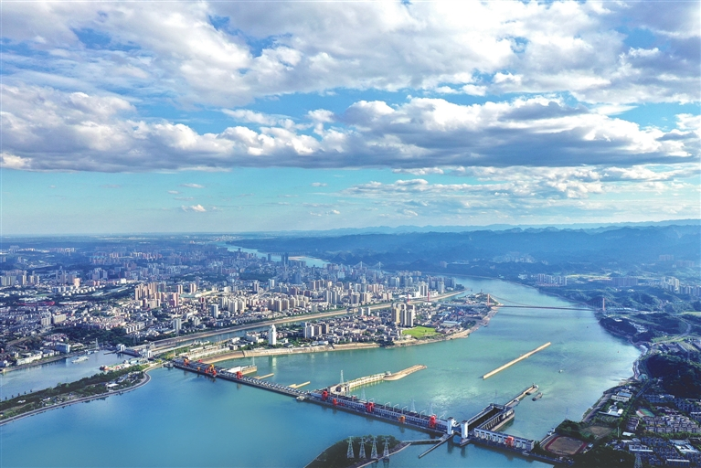
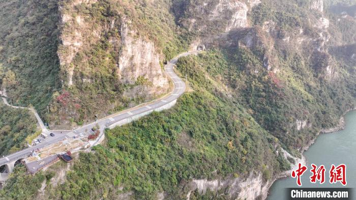
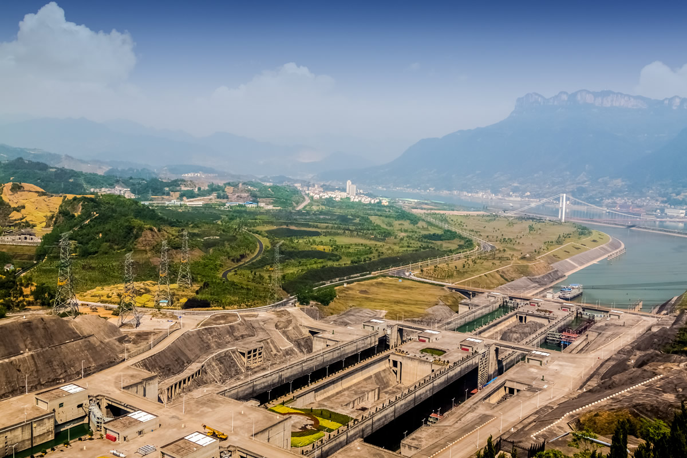
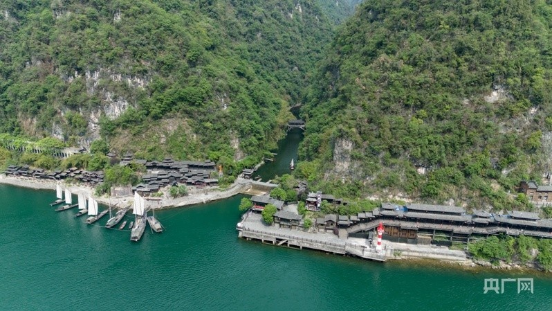
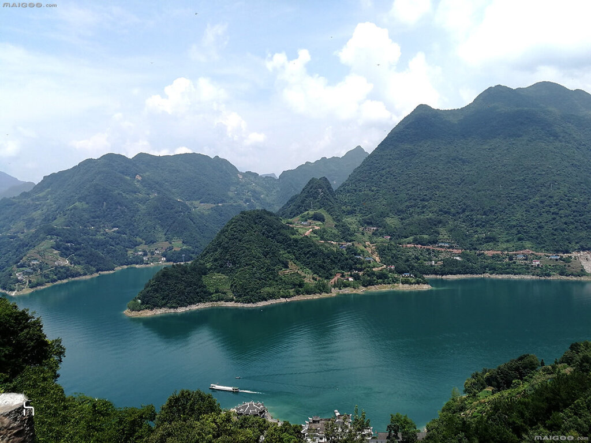
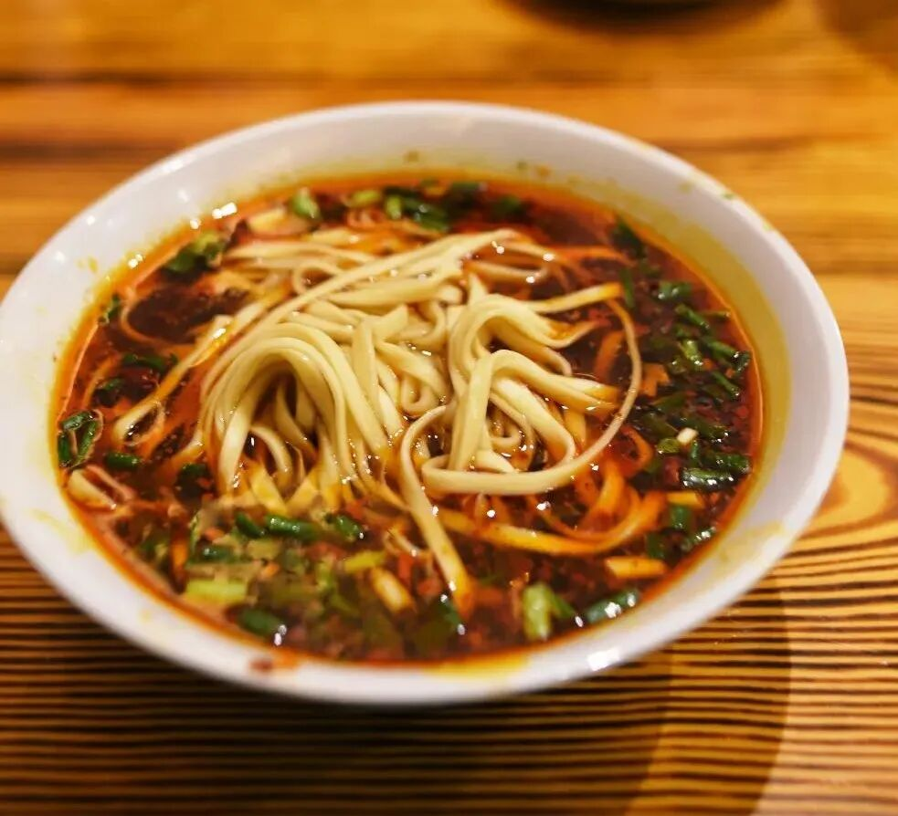

# 🏮 宜昌3天2晚自驾游旅行攻略

### 武汉出发 · 轻松版 · 春季推荐

| 📅 出行时间 | 👥 出行人群 | 🚗 出行方式 | 💰 人均预算 | ✈️ 出发城市 |
|:---:|:---:|:---:|:---:|:---:|
| **4-5月（春季最佳）** | 情侣/家庭/朋友 | **自驾** | **800~1200元** | **武汉** |

---

 

## 📦 出发前准备清单

> ▼ 自驾出行，这些物品一个都不能少！

### 🪪 证件类
- [ ] 身份证（**必备**，三峡大坝刷身份证入园）
- [ ] 驾驶证（自驾必备）
- [ ] 行驶证（随车携带）
- [ ] 学生证（如有，部分景点**半价**）
- [ ] 车辆保险单（确认在有效期内）

### 📱 电子设备
- [ ] 手机 + 车载充电器
- [ ] 充电宝（景区游玩必备）
- [ ] 行车记录仪（确认正常工作）
- [ ] 耳机
- [ ] 相机/拍立得（可选）
- [ ] 自拍杆

### 👗 穿搭准备
- [ ] 舒适运动鞋（日均步行1万步+）
- [ ] 薄外套/风衣（**早晚温差大**，江边风大）
- [ ] 长袖T恤/衬衫（白天可单穿）
- [ ] 短袖T恤（午后较热可换）
- [ ] 墨镜（江面反光强）
- [ ] 防晒衣/冰袖（自驾防晒）
- [ ] 雨具（**折叠伞/一次性雨衣**，春季多雨）

### 🧴 洗漱护肤
- [ ] 洗面奶、防晒霜（**SPF50+**）
- [ ] 保湿面膜、润唇膏
- [ ] 晴雨伞
- [ ] 湿巾/纸巾

### 💊 应急物品
- [ ] 肠胃药（水土不服）
- [ ] 感冒药
- [ ] 创可贴
- [ ] 晕船药（**坐船必带**）
- [ ] 防蚊液
- [ ] 矿泉水 + 零食（自驾途中补给）

### 🚗 车辆检查
- [ ] 检查轮胎气压和磨损
- [ ] 检查机油/冷却液/刹车油
- [ ] **加满油**（出发前）
- [ ] 备好ETC卡

---

 

## 🌤️ 宜昌天气参考（4-5月春季）

| 日期 | 天气 | 温度 | 穿衣建议 |
|:---:|:---:|:---:|:---|
| **Day1** | 🌥️ 多云转晴 | **14℃ ~ 23℃** | 长袖+薄外套，江边备风衣 |
| **Day2** | ⛅ 晴间多云 | **15℃ ~ 25℃** | 上午长袖，午后可短袖 |
| **Day3** | 🌧️ 多云有阵雨 | **13℃ ~ 22℃** | 薄外套+**雨具必备** |

> 💡 **温馨提示**：宜昌4-5月日均气温**14~23℃**，早晚温差约**10℃**。建议**"洋葱式穿搭"**——内搭速干T恤+中层薄毛衣+外层防风外套，随时增减。江边风大，体感温度比实际低**2~3℃**。春季偶有阵雨，**雨具随身携带！**

---

 

## 🗺️ 行程总览

> ▼ 武汉出发，沿G348三峡公路一路向西，3天打卡三峡大坝、清江画廊、三峡人家三大核心景区，感受大国重器的震撼与峡江山水之美。

| 日期 | 行程安排 | 主题 |
|:---:|:---|:---:|
| 🏃 **DAY1** | 武汉 → **G348三峡公路** → 滨江公园 → 陶珠路美食街 | 🛣️ **公路旅行·初识宜昌** |
| 🏃 **DAY2** | **三峡大坝** → 三峡人家 → 西坝不夜城 | 🏞️ **大国重器·峡江风情** |
| 🏃 **DAY3** | **清江画廊** → 长阳县城 → 返程武汉 | 🌊 **山水画卷·满载而归** |

---

 

## 🔻 DAY1：武汉 → G348三峡公路 → 滨江公园 → 陶珠路美食街

> 📍 当日主题：一路向西，沿江而行，从江城到峡江的浪漫自驾之旅

### ✅ 景点游玩建议

#### ① 上午游玩建议（G348三峡公路，建议安排 **3h**）

**☐ G348三峡公路（宜昌段）**
- **【🚗 交通】** 武汉出发走**G50沪渝高速**，约**320km / 3.5h**。建议在"三游洞景区"出口下高速，转入G348三峡公路。导航分段设置：**听风谷 → 山外山 → 明月台 → 莲沱畔服务区**，一路打卡。
- **【🎯 玩法】** G348是**中国最美地质公路之一**，全长约40km，沿途设有多个观景台和停车区。
  - 📍 **听风谷**：峡谷风口，风声呼啸，拍照超酷
  - 📍 **山外山**：360°观景台，远眺长江三峡入口
  - 📍 **明月台**：悬空玻璃观景台，脚下就是长江
  - 📍 **莲沱畔服务区**：白色风车建筑，网红打卡点
- **【📷 拍照】**
  - 莲沱畔服务区的白色风车建筑，人站风车前+长江背景，绝美
  - 明月台悬空玻璃栈道，低角度仰拍+广角，出片率100%
  - 公路弯道+江景同框，用长焦压缩空间感
- **【⚠️ 避坑】**
  - G348部分路段**弯道多、坡度大**，控制车速，注意会车
  - 观景台停车位有限，建议**工作日前往或早到**
  - 部分观景台免费，个别收费**5~10元/车**

#### ② 下午游玩建议（滨江公园，建议安排 **2h**）

**☐ 宜昌滨江公园**
- **【🚗 交通】** G348终点驶入宜昌市区，导航"滨江公园"，市区道路约**30分钟**。公园附近有收费停车场（约**5元/小时**）。
- **【🎯 玩法】** 滨江公园是宜昌的**"城市客厅"**，沿长江而建，全长约3.5km。
  - 🚶 漫步江边步道，远眺对岸青山
  - 🗼 打卡**天然塔**（宜昌地标），古塔临江而立
  - 🌅 傍晚时分来此看**长江日落**，金色余晖洒满江面
  - **免费开放**，全天可游
- **【📷 拍照】**
  - 天然塔+长江同框，经典机位
  - 日落时分（约**18:00~18:30**），江面金色倒影超美
  - 江边栏杆+远山背景，背影照很有氛围感
- **【⚠️ 避坑】**
  - 滨江公园**免费**，无需预约
  - 傍晚风大，注意保暖
  - 周末人较多，建议工作日或错峰

#### ③ 晚上游玩建议（陶珠路美食街，建议安排 **2h**）

**☐ 陶珠路美食街**
- **【🚗 交通】** 滨江公园步行或打车约**10分钟**即到，也可乘坐**30路公交**直达。
- **【🍜 美食】** 宜昌**最老牌**的美食街，本地人从小吃到大的地方。
  - 🥟 **萝卜饺子**（**5元/个**）：现炸现卖，外酥里嫩，宜昌No.1小吃
  - 🍜 **红油小面**（**8~12元**）：宜昌人的早餐灵魂，麻辣鲜香
  - 🥔 **炕土豆**（**5~8元**）：外焦里糯，撒上辣椒面和葱花
  - 🧊 **凉虾**（**3~5元**）：冰镇解腻，用大米浆做的特色饮品
  - 🍢 **烤鱼/串串**：北门夜市也有，推荐得胜街吴豆腐豆花鱼
- **【⚠️ 避坑】**
  - 萝卜饺子认准**排队长的摊位**，现炸的最好吃
  - 凉虾白天也有，但晚上逛夜市喝更惬意
  - 街边小摊建议**带现金**，部分不支持扫码

> 💰 **DAY1 预算参考**：油费/过路费约 250元/车 + 餐饮 80元/人 ≈ **205元/人**（按2人一车计算）

---

 

## 🔻 DAY2：三峡大坝 → 三峡人家 → 西坝不夜城

> 📍 当日主题：上午感受大国重器的震撼，下午沉浸峡江土家风情，晚上品尝地道江鲜

### ✅ 景点游玩建议

#### ① 上午游玩建议（三峡大坝，建议安排 **3.5h**）

**☐ 三峡大坝旅游区**
- **【🚗 交通】** 宜昌市区出发，走三峡专用公路约**40分钟**。车辆停放在**"高峡平湖·太平溪游客中心"停车场（免费）**，换乘景区大巴进入核心区。
- **【🎯 玩法】** **世界最大水利枢纽工程**，国家5A级景区。
  - 🎫 **门票**：🔴 **免费！** 只需购买景区交通车票 **35元/人**（建议提前在**"三峡大坝旅游"公众号**预约）
  - 🕐 **开放时间**：3月~12月15日 **08:00~17:00**；12月16日~2月28日 **08:30~16:30**
  - 📍 **游览路线**：坛子岭（俯瞰全景）→ **185平台**（近观大坝）→ 截流纪念园 → 三峡博物馆
  - 🚢 **推荐升级**：可加购"游船+大巴"套票约**165元/人**，从江面仰望大坝更震撼
  - ⏱️ 建议游玩 **3~4小时**
- **【📷 拍照】**
  - **坛子岭观景台**：大坝全景最佳机位，用广角拍摄
  - **185平台**：与大坝"零距离"合影，人站栏杆前+大坝背景
  - **截流纪念园**：四面体截流石旁拍照，很有纪念意义
  - **游船上仰拍大坝**：水面倒影+大坝，气势磅礴
- **【⚠️ 避坑】**
  - 🔴 门票免费但**必须提前在公众号预约！** 刷身份证入园
  - 景区内各平台之间有电瓶车（**10元/人**），不赶时间可以步行
  - 景区内餐饮较贵且选择少，**建议自带干粮和水**
  - 夏季暴晒，做好防晒；全年风大，**带件外套**
  - 周一至周日均可参观，但**节假日人流量极大**，建议早到

#### ② 下午游玩建议（三峡人家，建议安排 **3h**）

**☐ 三峡人家风景区**
- **【🚗 交通】** 从三峡大坝出发，驾车约**30分钟**即到三峡人家景区。导航"三峡人家游客中心"，景区停车场约**10元/次**。
- **【🎯 玩法】** 国家5A级景区，长江三峡**最原生态的土家风情古村落**。
  - 🎫 **门票**：约**150元/人**（含渡船），学生半价
  - 🕐 **开放时间**：**08:00~17:30**
  - 📍 **游览路线**：游客中心乘渡船 → **龙进溪景区**（溪边人家）→ 石牌抗战纪念馆 → 巴王寨 → 索道下山
  - 🎭 **特色体验**：土家婚嫁表演、峡江号子、龙舟竞渡
  - ⏱️ 建议游玩 **3小时**
- **【📷 拍照】**
  - **龙进溪**：吊脚楼+小溪+竹林，宛如世外桃源
  - **溪边浣衣女**：穿着土家服饰的姑娘在溪边洗衣（表演）
  - **巴王寨**：古寨城墙+远山云雾，很有武侠感
  - **石牌要塞**：抗战遗址+长江峡谷，历史厚重感
- **【⚠️ 避坑】**
  - 🔴 需提前在**"三峡人家"公众号**购票预约
  - 景区内需步行较多，**穿舒适运动鞋**
  - 渡船班次固定，注意**末班船时间（约16:30）**
  - 景区内有索道（**30元/人**），体力不好的建议乘坐
  - 雨天路滑，注意安全

#### ③ 晚上游玩建议（西坝不夜城，建议安排 **2h**）

**☐ 西坝不夜城**
- **【🚗 交通】** 三峡人家返回市区，导航"西坝不夜城"，驾车约**40分钟**。西坝是长江中的小岛，过桥即到。
- **【🍜 美食】** 宜昌夜生活的天花板，江中小岛上的美食天堂。
  - 🐟 **小雨天活鱼馆**：清江肥鱼一绝，鱼肉鲜嫩，汤底浓郁
  - 🐟 **鱼缘肥鱼馆**：本地人推荐的肥鱼老店
  - 🍲 **铁板清水鱼**：铁板现烤，外焦里嫩
  - 🍢 **黑子餐馆**：家常菜，分量足价格实惠
  - 🌃 江边夜景+烧烤+啤酒，惬意至极
- **【⚠️ 避坑】**
  - 热门餐厅建议**提前预约或早到**，周末排队**1h+**
  - 西坝桥上有时堵车，建议提前出发
  - 部分餐厅只收现金，备好零钱

> 💰 **DAY2 预算参考**：三峡大坝交通 **35元** + 三峡人家 **150元** + 餐饮 **150元** ≈ **335元/人**

---

 

## 🔻 DAY3：清江画廊 → 长阳县城 → 返程武汉

> 📍 当日主题：泛舟清江，人在画中游，带着峡江记忆满载而归

### ✅ 景点游玩建议

#### ① 上午游玩建议（清江画廊，建议安排 **4h**）

**☐ 清江画廊风景区**
- **【🚗 交通】** 宜昌市区出发，走沪蓉高速约**1.5h**到达长阳县城，再沿指示牌行驶约**20分钟**到达景区。全程约**100km**。景区停车场约**10元/次**。
- **【🎯 玩法】** 国家5A级景区，**"清江水清十丈，人见人爱清江"**。泛舟清江，两岸青山如画屏。
  - 🎫 **门票**：
    - **A线**（含游船）：成人 **140元**，优待票 95元
    - **B线**（含游船）：成人 **95元**，优待票 55元
    - A线+往返交通：成人 **160元**
  - 🕐 **开放时间**：**08:00~17:00**
  - 📍 **推荐A线**：游客中心乘船 → **武落钟离山**（土家族发源地）→ 倒影峡 → 天柱山
  - 🚢 游船约1小时单程，全程含游览约**4小时**
  - ⏱️ 建议游玩 **4~4.5小时**
- **【📷 拍照】**
  - **游船甲板上**：两岸青山倒映碧水，随手拍都是大片
  - **倒影峡**：水面如镜，山影倒映，对称构图绝美
  - **武落钟离山**：登顶俯瞰清江全景，壮阔震撼
  - **土家风情表演**：色彩鲜艳的民族服饰，很有特色
- **【⚠️ 避坑】**
  - 🔴 建议提前在**"清江画廊"公众号**购票
  - 🔴 一定要选**晴天**去！阴天/雨天风景大打折扣
  - 游船上风大，**带件外套**
  - 晕船的朋友**提前吃晕船药**
  - **A线比B线更值得**，多一个武落钟离山
  - 末班船约**15:30**，建议上午早到

#### ② 下午游玩建议（长阳县城午餐，建议安排 **1.5h**）

**☐ 长阳县城**
- **【🚗 交通】** 清江画廊景区出来，驾车约**20分钟**回到长阳县城。
- **【🍜 美食】** 长阳是**土家族自治县**，这里的美食更地道更便宜！
  - 🥘 **土家腊蹄子火锅**：土家族招牌菜，腊猪蹄炖土豆/萝卜，香到骨子里
  - 🥔 **长阳炕土豆**：比市区更正宗，外焦里糯
  - 🐟 **清江野鱼**：江边现捞现做，鲜到眉毛掉下来
  - 🫕 **土家社饭**：腊肉+野菜+糯米，传统土家风味
  - 人均**40~60元**，比市区便宜一半
- **【⚠️ 避坑】**
  - 县城餐馆中午**12:30后**部分关门午休
  - 推荐找**本地人多的馆子**，味道不会差

#### ③ 下午·返程武汉（约 **4h**）

- **【🚗 交通】** 长阳县城出发，走沪蓉高速转**G50沪渝高速**返回武汉，全程约**350km**，约**4小时**。
- **【💡 建议】** **14:00**左右出发，**18:00**左右到达武汉，避开晚高峰。
- **【⛽ 沿途补给】** 高速服务区较多（枝江、荆州等），不用担心。
- **【⚠️ 避坑】**
  - 🔴 周日下午高速可能拥堵，**建议提前出发**
  - 注意检查油量，服务区间隔较远

> 💰 **DAY3 预算参考**：清江画廊 **140元** + 餐饮 **80元** + 油费/过路费约 150元/车 ≈ **295元/人**（按2人一车计算）

---

 

## 🍛 宜昌美食打卡

| 美食名称 | 推荐指数 | 人均价格 | 特色描述 | 推荐店铺/位置 |
|:---:|:---:|:---:|:---|:---|
| 🐟 **清江肥鱼** | ⭐⭐⭐⭐⭐ | **60~100元** | 清江野生鱼，肉质细嫩无刺，汤白如奶，鲜到灵魂出窍 | 西坝·**小雨天活鱼馆**、鱼缘肥鱼馆 |
| 🥟 **萝卜饺子** | ⭐⭐⭐⭐⭐ | **5元/个** | 不是煮的！米浆裹萝卜丝油炸，外酥里嫩，撒辣椒面绝了 | **陶珠路美食街**、CBD小吃街入口 |
| 🍜 **红油小面** | ⭐⭐⭐⭐⭐ | **8~12元** | 宜昌人的早餐灵魂，麻辣鲜香，一碗下肚浑身暖 | **铁路坝小吃街**、街边老店 |
| 🥔 **炕土豆** | ⭐⭐⭐⭐⭐ | **5~8元** | 土豆切块在铁板上炕至金黄，外焦里糯，撒辣椒面+葱花 | 陶珠路、**北门夜市** |
| 🧊 **凉虾** | ⭐⭐⭐⭐ | **3~5元** | 大米浆做的特色饮品，冰镇后滑嫩爽口，红糖水底超解腻 | 全城街头都有，推荐陶珠路 |
| 🥘 **土家腊蹄子** | ⭐⭐⭐⭐⭐ | **50~80元** | 土家族招牌菜，腊猪蹄炖土豆，腊肉香浓，下饭神器 | **长阳县城**本地馆子 |
| 🍢 **烤鱼/串串** | ⭐⭐⭐⭐ | **40~60元** | 江边烧烤+冰啤酒，宜昌夜生活标配 | **北门夜市**、西坝不夜城 |
| 🫕 **红油包子** | ⭐⭐⭐⭐ | **3~5元/个** | 宜昌特色早餐，包子皮浸满红油，一口爆汁 | 铁路坝小吃街 |

> 📍 **美食街区推荐**：
> - 🏆 **陶珠路美食街**：最老牌最地道，萝卜饺子+凉虾+红油小面一条龙
> - 🌃 **西坝不夜城**：江鲜为主，清江肥鱼必吃，夜景绝美
> - 🔥 **北门夜市**：烤鱼、虾球、红油小面，夜宵好去处
> - 🚌 **30路美食公交专线**：串联**6大美食区**（长江广场夜市→兴发巴楚食巷→万达美食街→陶珠路→铁路坝→解放路），**一条公交吃遍宜昌！**

---

 

## 🏨 宜昌住宿指南

| 区域 | 优点 | 缺点 | 适合人群 | 参考价格 |
|:---|:---|:---|:---:|:---:|
| 🌊 **沿江大道** （伍家岗段） | ✅ 一线江景，推窗见长江 ✅ 靠近万达商圈 ✅ 夜景绝美 | ❌ 价格偏高 ❌ 周末停车位紧张 | 👥 情侣 👥 摄影爱好者 | **300~600元**/晚 |
| 🏙️ **西陵区** （解放路/CBD） | ✅ 市中心，吃喝玩乐方便 ✅ 紧邻滨江公园和陶珠路 ✅ 交通便利 | ❌ 部分酒店设施较旧 ❌ 周末人多热闹 | 👥 **所有人群** ⭐ 首推区域 | **150~400元**/晚 |
| 🏝️ **西坝岛** | ✅ 独特江心岛体验 ✅ 美食集中（不夜城） ✅ 安静惬意 | ❌ 进出靠桥，高峰期堵车 ❌ 选择较少 | 👥 美食爱好者 👥 追求特色体验 | **200~350元**/晚 |
| 🏞️ **夷陵区** （三峡大坝周边） | ✅ 距三峡大坝近 ✅ 环境清幽 | ❌ 远离市区 ❌ 晚上没啥可逛 ❌ 餐饮选择少 | 👥 第二天一早 去大坝的人 | **150~300元**/晚 |

> 💡 **住宿建议**：推荐住 **西陵区解放路/沿江大道** 附近，距离滨江公园、陶珠路美食街**步行可达**，去各大景区驾车也方便。如果预算充足，沿江大道的**江景酒店**（如华美达）体验感拉满。

---

 

## 🚄 宜昌交通指南

### 🚗 自驾·武汉 → 宜昌（核心路线）

| 路线 | 距离 | 耗时 | 过路费 | 油费（参考） |
|:---|:---:|:---:|:---:|:---:|
| **G50沪渝高速**（主流） | 约320km | **3.5~4h** | 约150元 | 约200元 |
| **G348三峡公路**（⭐推荐） | 约350km | **4~5h** | 约100元 | 约220元 |

> 💡 **强烈推荐G348三峡公路路线！** 虽然多花1小时，但沿途风景绝美，多个观景台可停车打卡，自驾体验感满分。建议**第一天走G348，第三天走G50高速返程**。

### ✈️ 飞机（备选方案）
- **机场**：宜昌三峡国际机场，距市中心约**26km**
- 机场大巴：**20元**，约40分钟
- 打车/网约车：约**60~80元**
- 机场至市区**无地铁**

### 🚄 高铁/火车
- **宜昌东站**（主要高铁站，伍家岗区，距市中心约8km）
  - 武汉→宜昌东：高铁约**2h**，二等座约**100~120元**
  - 出站可打车或乘BRT快速公交进入市区
- **宜昌站**（老火车站，西陵区，离市中心更近）
  - 普速列车为主，武汉→宜昌约**4~5h**

### 🚇 市内交通
- **BRT快速公交**：宜昌特色，**1元**起步，覆盖主要景区和商圈
- **普通公交**：票价**1~2元**，推荐**30路美食公交专线**
- **出租车/网约车**：起步价**6~8元**，市区内一般**10~20元**
- **共享单车**：哈啰/美团均有，适合滨江公园骑行
- **自驾停车**：景区停车场一般**10元/次**，市区路边**3~5元/小时**

---

 

## 📷 宜昌拍照出片点

| 序号 | 拍摄地点 | 最佳时间 | 拍摄建议 | 出片风格 |
|:---:|:---|:---:|:---|:---:|
| 1 | **G348莲沱畔服务区** | 上午10:00 | 白色风车+长江背景，人站风车前 | 🛣️ 公路旅行风 |
| 2 | **G348明月台** | 上午10:30 | 悬空玻璃栈道，低角度仰拍 | 🏔️ 震撼风光 |
| 3 | **滨江公园·天然塔** | 傍晚18:00~18:30 | 日落时分，塔+江面金色倒影 | 🌅 古风意境 |
| 4 | **三峡大坝·坛子岭** | 上午9:00~10:00 | 广角俯瞰大坝全景 | 🏗️ 大气磅礴 |
| 5 | **三峡大坝·185平台** | 上午10:00 | 人站栏杆前+大坝背景 | 📸 纪念打卡 |
| 6 | **三峡人家·龙进溪** | 下午14:00~15:00 | 吊脚楼+溪水+竹林，溪边蹲拍 | 🏡 世外桃源 |
| 7 | **三峡人家·巴王寨** | 下午15:00 | 古寨城墙+远山云雾 | ⚔️ 武侠古风 |
| 8 | **清江画廊·游船甲板** | 上午10:00~11:00 | 两岸青山+碧水倒影 | 🌊 山水画卷 |
| 9 | **清江画廊·倒影峡** | 上午11:00 | 水面如镜，对称构图 | 🪞 唯美风光 |
| 10 | **西坝不夜城·江边** | 晚上19:30~20:30 | 江面灯光+烧烤烟火气 | 🌃 夜市人文 |

---

 

## 🎫 需要预约的景点

| 景点名称 | 门票价格 | 开放时间 | 预约方式 | 预约难度 |
|:---|:---:|:---:|:---|:---:|
| **三峡大坝** | 🔴 **免费**（交通35元） | **08:00~17:00** | "三峡大坝旅游"公众号 | ⭐⭐ |
| **三峡人家** | **150元**（含船） | **08:00~17:30** | "三峡人家"公众号 | ⭐⭐⭐ |
| **清江画廊** | **140元**（A线含船） | **08:00~17:00** | "清江画廊"公众号 | ⭐⭐⭐ |
| 三峡大坝游船 | 约**165元**（套票） | 09:00~16:00 | 景区现场或公众号 | ⭐⭐⭐⭐ |
| 三峡人家索道 | **30元**（单程） | 08:30~17:00 | 景区内现场购票 | ⭐ |

> ⚠️ **预约提醒**：三峡大坝和三峡人家建议至少**提前1~2天**在公众号预约，节假日**提前3~5天**。清江画廊淡季可随买随用，旺季建议提前预约。

---

 

## 📌 宜昌自驾游实用Tips

> ▼ 10条本地人总结的实用建议，出发前必看！

1. **🚗 自驾路线选择**
   去程走**G348三峡公路**（风景绝美，多预留1h），回程走**G50沪渝高速**（快速便捷）。G348弯道多，新手司机注意安全。

2. **🏗️ 三峡大坝攻略**
   🔴 **免费但必须预约！** 刷身份证入园。景区内各平台之间有电瓶车（**10元**），不赶时间可步行。建议加购游船票，从江面看大坝更震撼。

3. **🌤️ 清江画廊看天气**
   🔴 **一定要晴天去！** 阴雨天风景大打折扣。出发前查好长阳天气预报，如果预报有雨，可以和DAY2的行程互换。

4. **🏨 住宿选择**
   推荐住**西陵区解放路/沿江大道**附近，吃喝玩乐都方便。预算充足选**江景房**，推开窗就是长江。

5. **🅿️ 停车信息**
   景区停车场一般**10元/次**，市区路边**3~5元/小时**。西陵区CBD和万达有大型地下停车场。

6. **🍜 吃饭防坑**
   🔴 **别在景区内吃饭！** 景区餐饮又贵又一般。三峡大坝自带干粮，其他景点回市区或县城吃。

7. **💰 省钱技巧**
   学生证**半价**（三峡人家、清江画廊）；宜昌旅游年卡（**100元/年**）包含多个景点；高速ETC打折。

8. **⛽ 加油提醒**
   宜昌到长阳之间加油站较少，**出发前加满油**。三峡专用公路沿途无加油站。

9. **📷 拍照装备**
   **广角镜头**拍大坝和山水，**长焦**压缩G348公路空间感。手机也能出片，关键在光线和构图。

10. **📞 应急信息**
    - 宜昌市中心医院：**0717-6223999**
    - 高速救援：**12122**
    - 宜昌旅游投诉热线：**0717-6253500**

---

 

## 📱 宜昌朋友圈文案

> ▼ 12条精选文案，发朋友圈直接复制！

1. ✅ 打卡📍宜昌 2026.04
2. 从江城到峡江，一路向西，山水如画 🚗💨
3. 📍宜昌 | 大国重器三峡大坝，站在185平台的那一刻，真的会热泪盈眶🇨🇳
4. 清江水清十丈，人在画中游 🌊✨
5. G348三峡公路，每一个弯道都是一幅画 🏔️🛣️
6. 宜昌的萝卜饺子，一口咬下去，外酥里嫩，从此念念不忘 🥟❤️
7. 三峡人家，吊脚楼前溪水流，仿佛穿越回了千年前的峡江 🏡🌿
8. 清江画廊的倒影峡，水面如镜，分不清哪里是山哪里是水 🪞⛰️
9. 西坝岛上吹着江风吃肥鱼，这才是宜昌的正确打开方式 🐟🍻
10. 三天两晚，从武汉到宜昌，320公里的距离，却像是到了另一个世界 🌍✈️
11. 📍宜昌·三峡大坝 | 世界上最大的水利工程，亲眼所见比任何照片都震撼
12. 宜昌的春天，是江风的味道，是红油小面的辣味，是清江画廊的绿意 🌸

---

 

## 💰 费用预算参考（人均·2人一车）

| 项目 | 预算（元） | 备注 |
|:---|:---:|:---|
| 🚗 油费+过路费 | **350** | 武汉↔宜昌往返（含G348绕路） |
| 🏨 住宿 | **300** | 2晚，150~300元/晚（经济型） |
| 🎫 门票 | **325** | 三峡大坝35 + 三峡人家150 + 清江画廊140 |
| 🍜 餐饮 | **300** | 3天，约100元/天 |
| 🅿️ 停车+其他 | **50** | 景区停车+杂费 |
| **💰 合计** | **≈ 1,325** | |

> 💡 **省钱版**（约**800元/人**）：住经济型酒店（100元/晚）+ 不坐三峡大坝游船 + 长阳县城吃饭 + 减少购物
>
> 💡 **品质版**（约**1,800元/人**）：住江景酒店（400元/晚）+ 三峡大坝游船套票 + 西坝肥鱼大餐 + 买特产
>
> ⚠️ 以上为参考预算，实际花费因个人消费习惯而异。价格仅供参考，以实际为准。

---

 

> 📌 **写在最后**：宜昌是一座被低估的宝藏城市。这里有世界最大的水利工程、有如画的峡江山水、有地道的土家风情、有让人念念不忘的清江肥鱼和萝卜饺子。三天两晚，刚好够你爱上这座城。祝旅途愉快！🚗🌈

